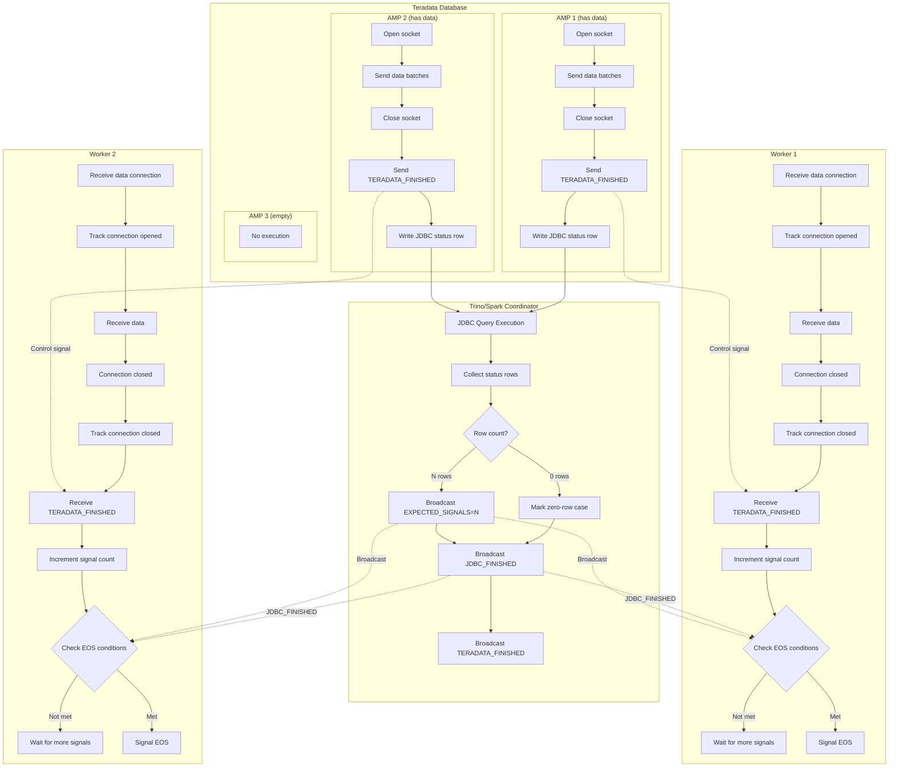
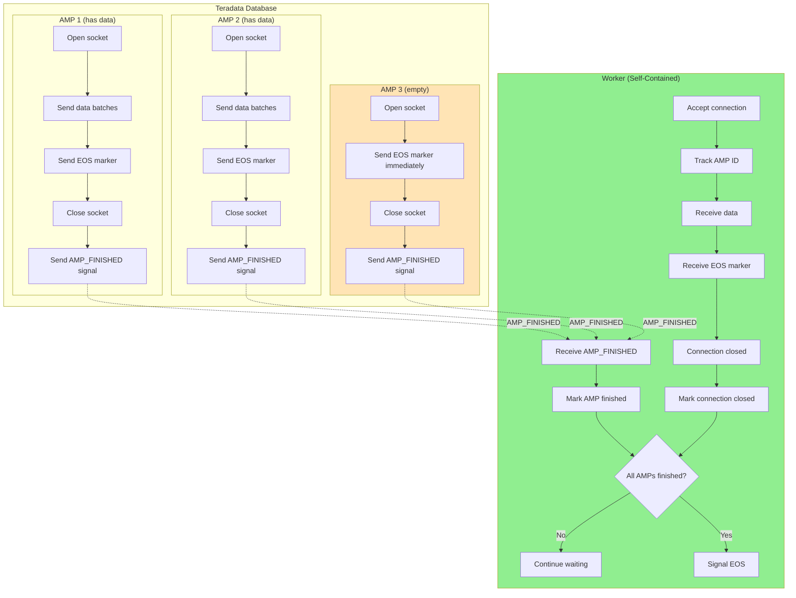
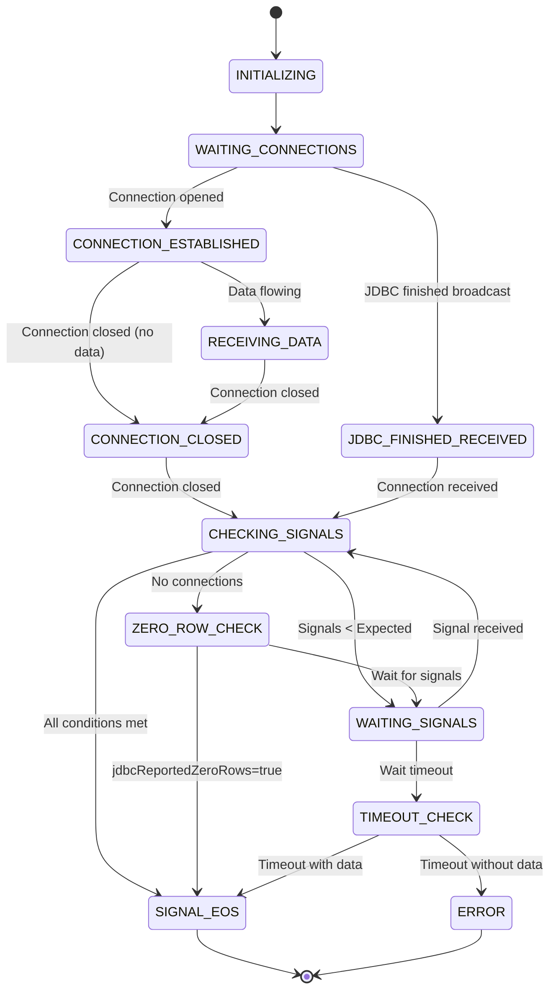
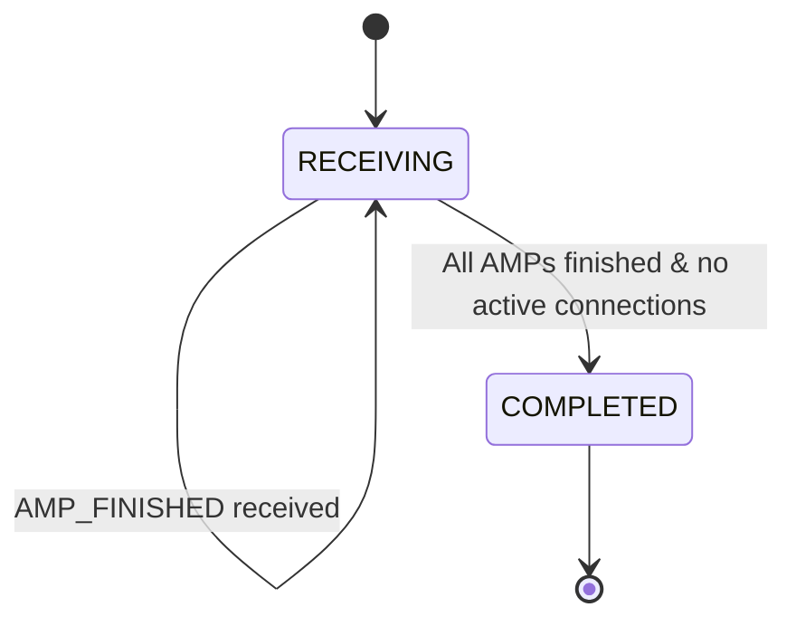
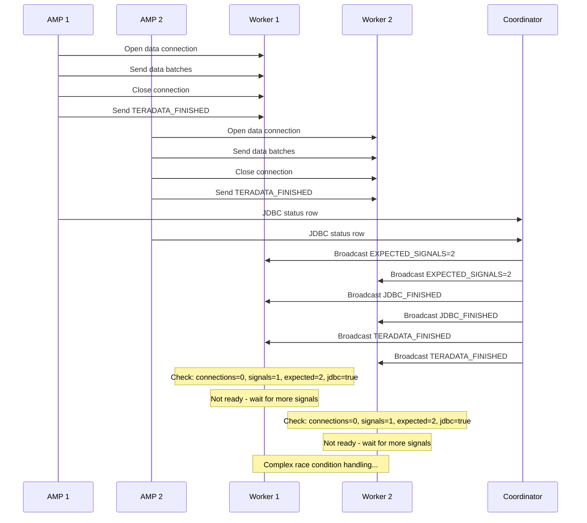
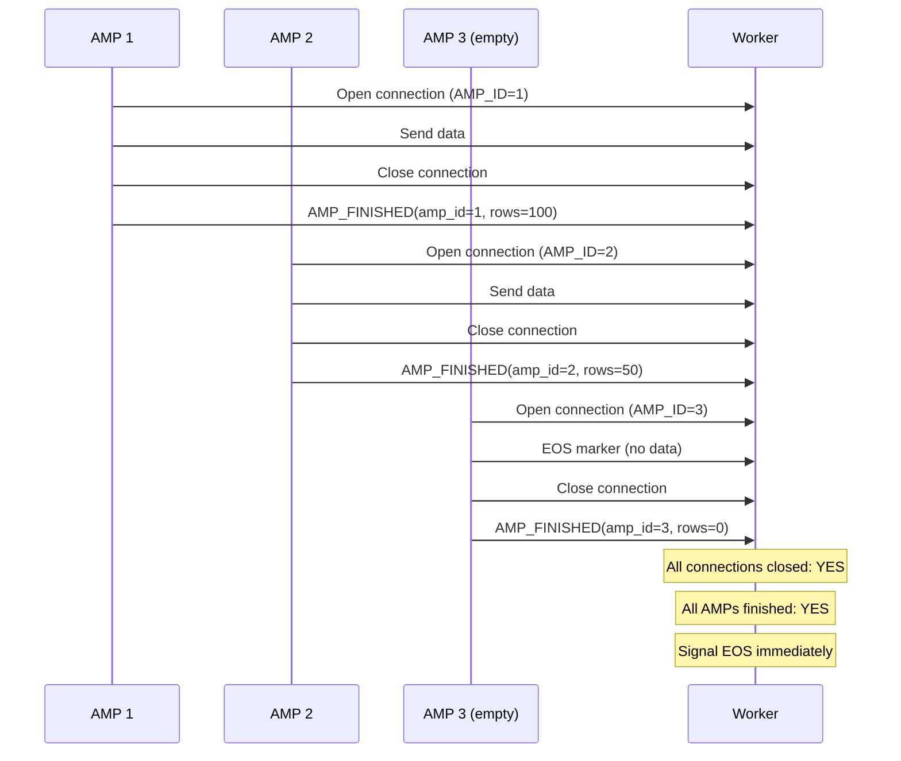
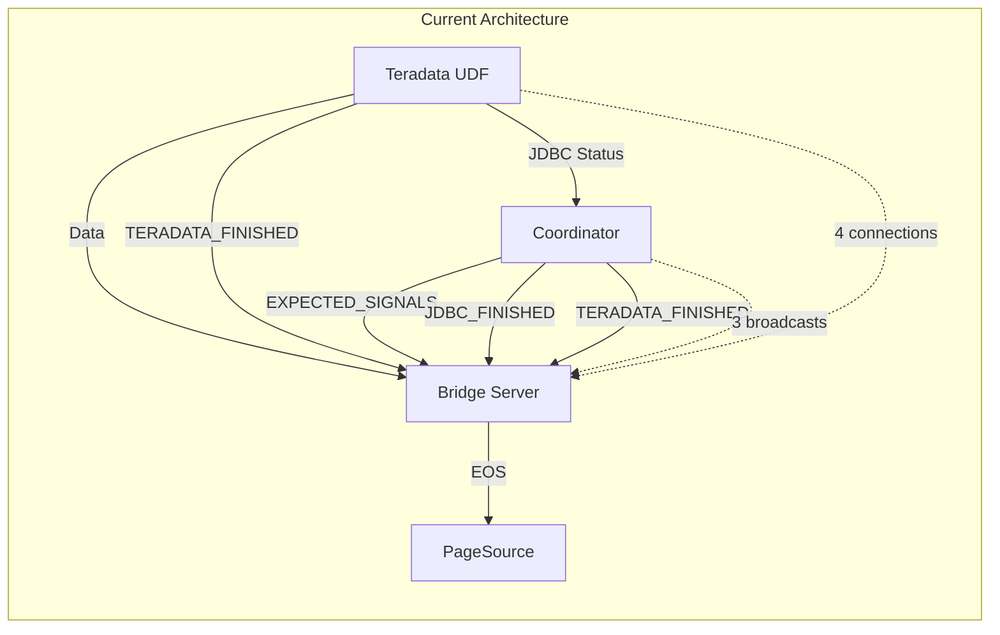
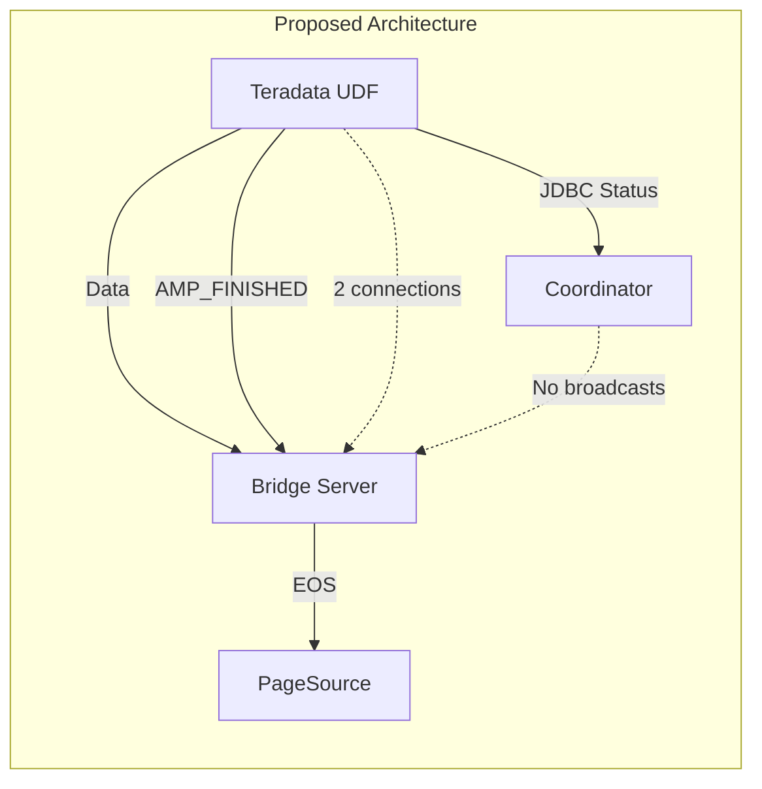
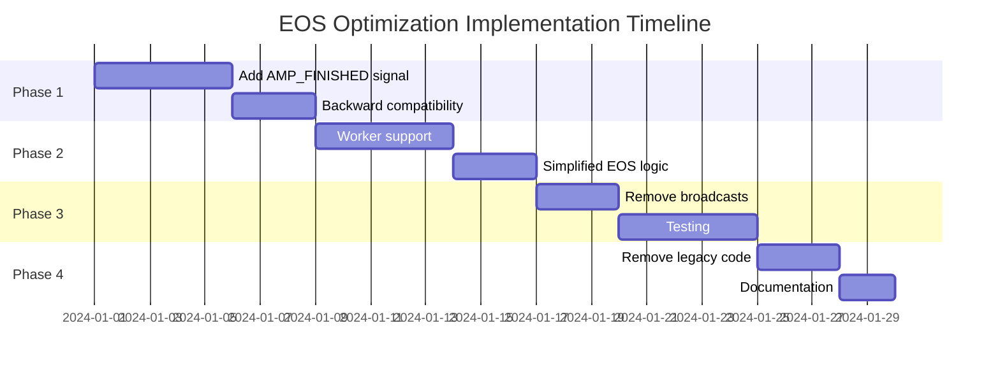

# EOS Architecture Diagrams

## Current Architecture (Complex)



## Proposed Simplified Architecture



## State Machine Comparison

### Current State Machine (Complex)



### Proposed State Machine (Simplified)



## Signal Flow Comparison

### Current: Multi-Signal Coordination



### Proposed: Single Signal Per AMP



## Component Interaction

### Current: Tight Coupling



### Proposed: Loose Coupling



## Data Structures Comparison

### Current: Complex State Tracking

```java
class QueryBuffer {
    // Connection tracking
    AtomicInteger activeConnections;
    AtomicInteger totalConnectionsOpened;
    AtomicInteger totalConnectionsClosed;
    
    // Signal tracking
    AtomicInteger expectedTeradataSignals;
    AtomicInteger receivedTeradataSignals;
    
    // State flags
    volatile boolean jdbcFinished;
    volatile boolean teradataFinished;
    volatile boolean eosSignaled;
    volatile boolean jdbcReportedZeroRows;
    volatile boolean hadAnyConnections;
    
    // Consumer tracking
    AtomicInteger activeConsumers;
    AtomicInteger totalFinishedConsumers;
    volatile int expectedConsumers;
    
    // Timing
    volatile long lastActivityTime;
    volatile boolean delayedEosScheduled;
}
```

### Proposed: Minimal State

```java
class SimpleQueryBuffer {
    // AMP tracking only
    Set<Integer> activeAmps = ConcurrentHashMap.newKeySet();
    Set<Integer> finishedAmps = ConcurrentHashMap.newKeySet();
    
    // Simple state
    enum State { RECEIVING, COMPLETED }
    volatile State state = State.RECEIVING;
    
    // Consumer tracking (unchanged)
    AtomicInteger activeConsumers;
}
```

## Benefits Summary

| Aspect | Current | Proposed | Improvement |
|--------|---------|----------|-------------|
| Signal Types | 4 | 1 | 75% reduction |
| State Variables | 12+ | 3 | 75% reduction |
| Network Messages | 7 per query | 2 per AMP | Varies |
| Race Conditions | 6+ | 0 | 100% elimination |
| Special Cases | 4 | 0 | 100% elimination |
| Code Complexity | High | Low | 63% reduction |
| Coordinator Dependency | Required | None | Decoupled |

---

## Migration Path


