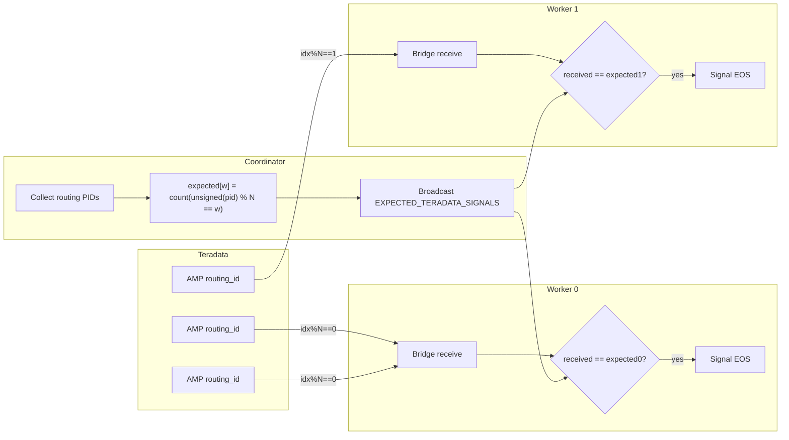
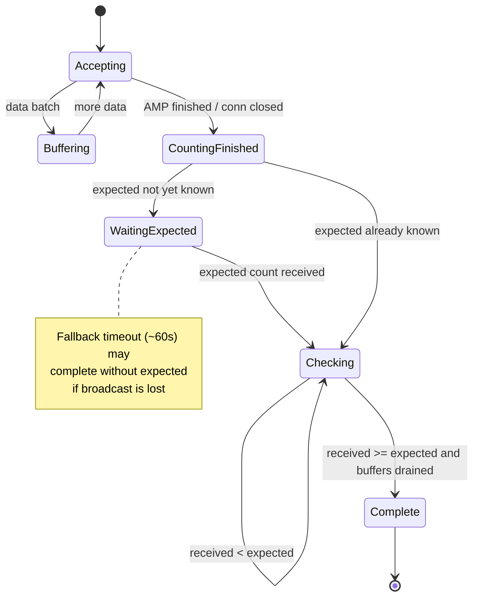

# EOS diagrams (current design)

> Canonical write-up: [eos.md](eos.md).  
> This file keeps diagrams only. Historical JDBC_FINISHED-first designs are omitted.

## Per-worker expected counts



## Worker-local state



## Control command ids

| Id | Name | Current behavior |
|----|------|------------------|
| 1 | AMP / external finished | Increments received finished count |
| 2 | JDBC_FINISHED | **Ignored** (legacy) |
| 3 | EXPECTED_TERADATA_SIGNALS | Sets expected count for this worker |

## Ordering invariant

```text
receive batch → decompress → parse Page → enqueue buffer
                                              ↓
                                    then mark connection finished
                                              ↓
                                    then evaluate EOS predicate
```

Never mark finished before the last page for that connection is enqueued.
