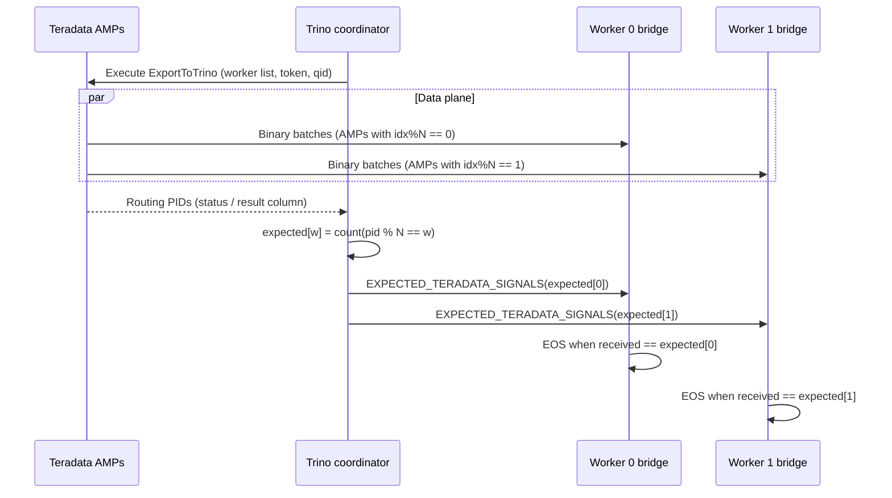

# End-of-stream (EOS) design

## Goal

Finish a split **exactly when** all AMP data intended for that worker has been
received and buffered — without:

- hanging forever on workers that receive zero AMP connections, or
- closing early while data is still in flight, or
- relying on a short idle timeout as the primary completion signal.

## Deterministic model (current)



### Routing ID

In `export_to_trino.c`:

```c
INTEGER raw_pid = getpid();
INTEGER routing_id = raw_pid ^ (raw_pid >> 8);
assigned_worker_idx = routing_id % worker_count;
/* routing_id returned so Java can recompute the same mapping */
```

Java must use **unsigned** 32-bit modulo when tallying:

```java
int workerIdx = (int) (Integer.toUnsignedLong(ampId) % numWorkers);
```

Mismatch between signed and unsigned modulo caused historical multi-worker hangs
(wrong expected counts → workers waiting for connections that never arrive).

### Bridge control commands

| Command | Id | Behavior |
|---------|----|----------|
| External / AMP finished | 1 | Count toward received finished signals |
| JDBC_FINISHED | 2 | **Deprecated — ignored** |
| EXPECTED_TERADATA_SIGNALS | 3 | Sets per-worker expected connection count |

### Buffering rule

Data is pushed into `DataBufferRegistry` **before** connection-finished accounting
decrements. EOS checks only run after that ordering, so pages are not lost to a
premature “finished” state.

### Fallback

If expected counts are never received (~60s), fallback heuristics may complete
the query to avoid permanent hangs. Investigate:

- advertised worker addresses not reachable from AMPs
- PID column not returned / wrong type mapping
- worker count used at UDF time ≠ worker count used when computing expectations

## Historical designs (not primary)

Older diagrams described multi-signal protocols (`JDBC_FINISHED` broadcasts,
global TERADATA_FINISHED storms, short 5s idle timeouts). Those are **not** the
primary completion path in the current code. Keep them out of operational runbooks.

## Multi-worker checklist

1. Same plugin version on every node.
2. `worker-advertised-addresses` lists every bridge **as Teradata sees it**.
3. Bridge ports open only from Teradata → workers.
4. Logs show `DETERMINISTIC EOS: N AMPs distributed across M workers` without timeouts.
